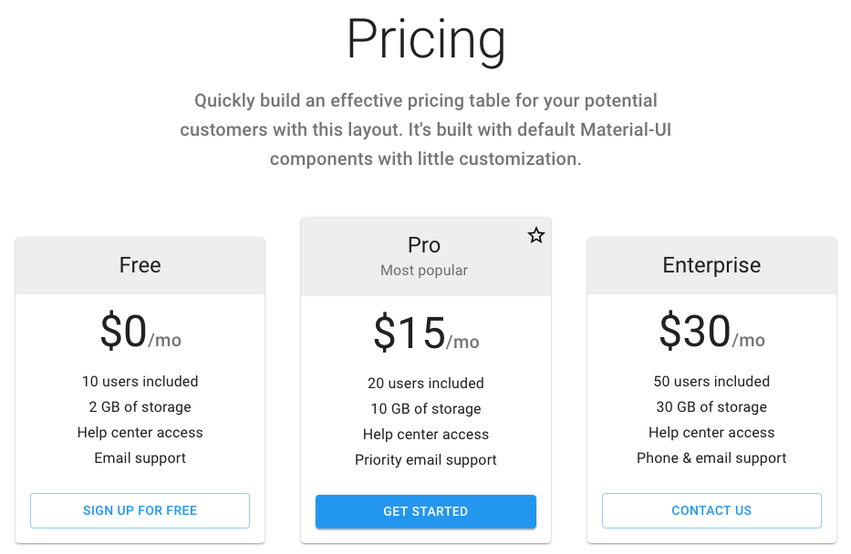
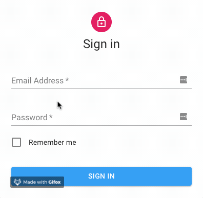
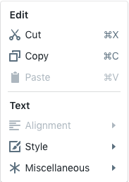
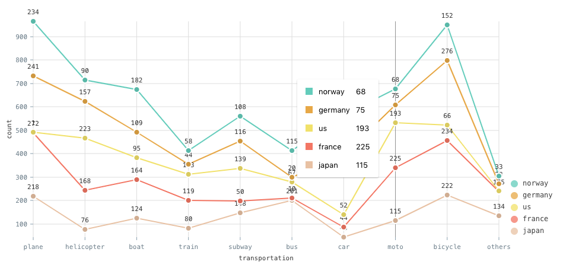

# Component Libraries

There are a lot of technologies that I have learned that have been very valuable in my experiences in tech. Some examples include git, scikit-learn, and command line usage. But today I’m going to try to convince you that React is a really cool and valuable technology to learn.

You probably want to start off learning HTML, CSS, and JavaScript to build basic sites. But learning React and its ecosystem has given me a way to make great looking complex applications pretty quickly. React is based off of building reusable components. This means that you get the ability to import components such as **input fields, navigation, menus, carousels, etc.** Components even get as complex as calendars or data visualizations.

There are **_tons_** of component libraries available to use, but let me just show you a few.

## Material-UI

The most popular component library right now is material-ui for a good reason. They have a pretty good collection of basic ui elements such as input fields, buttons, and navigation that look great and are super customizable.  Porch uses a pretty customized library of these components, so if you want to see an example of how much you can control, just head to [Porch](https://porch.com).   Here’s an example of a UI that could be built by just importing some components out of the box.



You also get control to programmatically update colors, meaning that you can easily incorporate a light and dark theme to your site (which I am a fan of!)

Components in this library also have really great animations that make your site look really professional. I mean look at this:



## Blueprint

Another great repository of React components is made by Palantir. You can easily tell that these are made for more advanced applications. They include dozens of components that could be used to build a pretty functional site. Here’s an example of a menu to give you some context around the design:



## Nivo

Nivo is a React component library that focuses on data visualizations. Really pretty data visualizations. You can customize tons of things like curve type, styles, axis, legends, and even motion. Their documentation is great and their site allows you to customize the plots to your liking before even coding them in React.  [nivo | demo](https://nivo.rocks) 



Data is taken into this plot as an array of x and y points as shown. You can even pass in dates.

```{json}
Array<{
    id: {string|number}
    data: Array<{
        x: {number|string|Date}
        y: {number|string|Date}
    }>
}>
```

I'm going to stop there, but if you do some research, you can find countless libraries that make it easy to plug in various functionality into your site or mobile applicaiton. Oh yeah, React can be used for iOS and Android apps, but more on that later!
