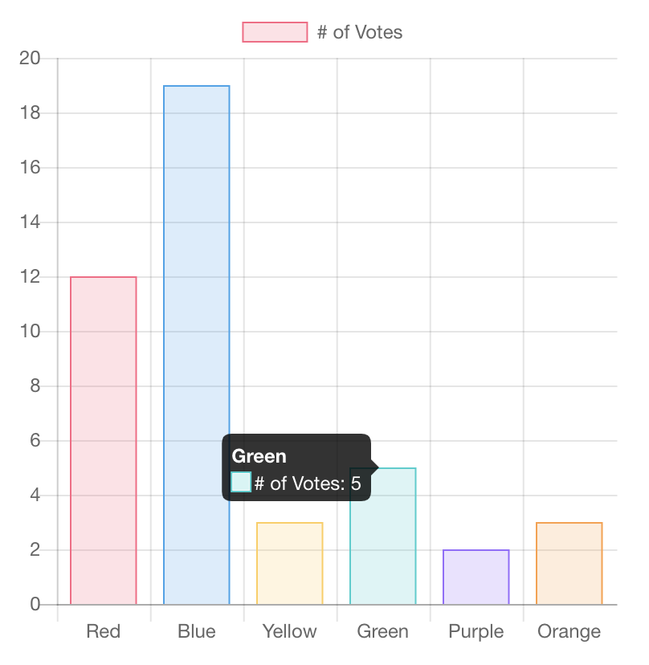
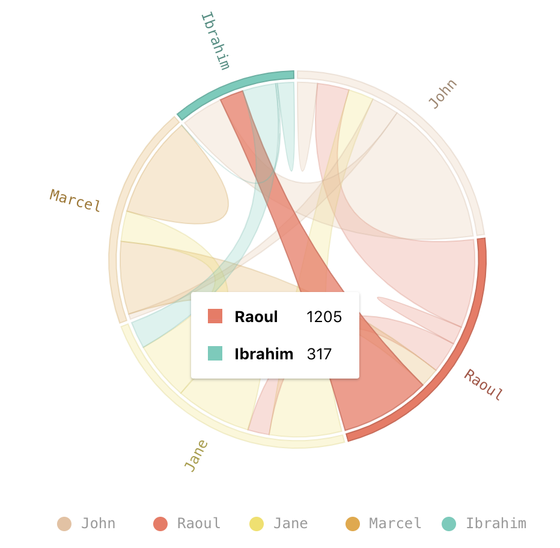
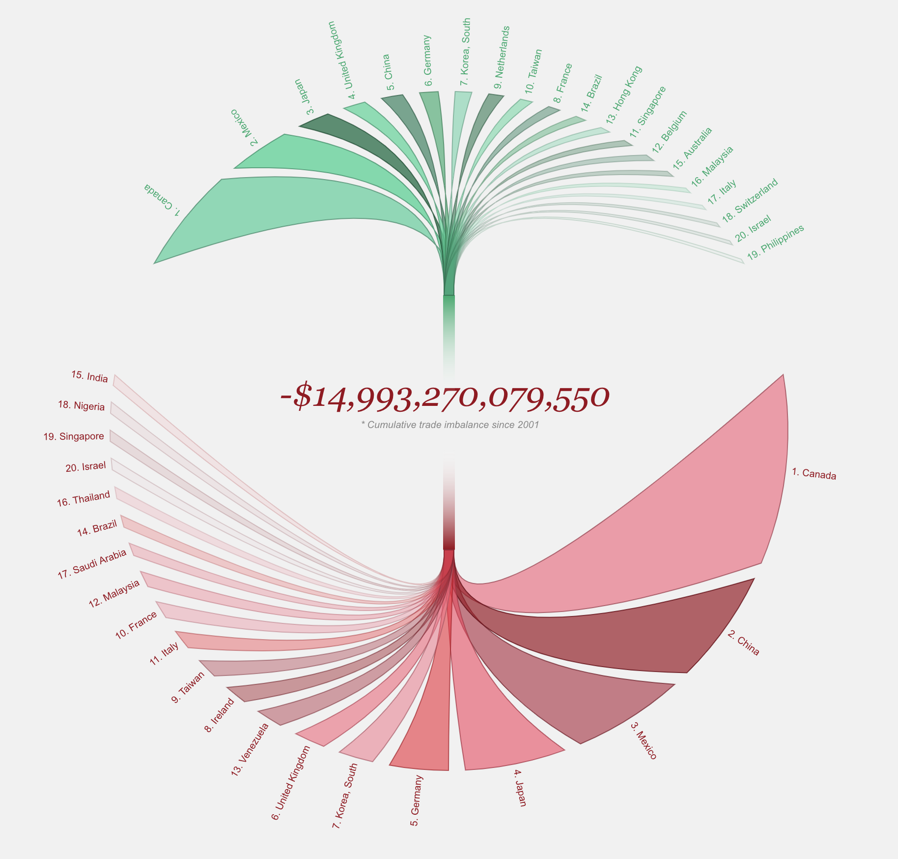

A lot of data science consists of communicating your findings to other people including your team, clients, or various stakeholders. There are plenty of ways to do this including using tools ranging from Microsoft Excel to matplotlib to using tools like Tableau. Each of these has their own advantages and many are very easy to get started with. But there is a lot of power through interacting with the web, and today we’re going to explore that.

## Introducing Chart.js

Everything on the web is based off of HTML, CSS, and JavaScript (JS). HTML gives you the structure of the page, CSS give you the styling, and JavaScript gives you pretty much everything else. While we could create data visualizations using raw JS, it is much easier to get started with a library such as [Chart.js](https://www.chartjs.org/ "Chart.js"). This gives you the ability to add interactive charts to your webpage such as this one: 

## Let’s Get Started

First, create a directory for this project anywhere you like. Create two files: `index.html` and `script.js`.

We’re going to start off with our index.html file and put the basic html boilerplate code.

### index.html

```html
<!DOCTYPE html>
<html lang="en">

<head>
    <meta charset="UTF-8">
    <meta name="viewport" content="width=device-width, initial-scale=1.0">
    <meta http-equiv="X-UA-Compatible" content="ie=edge">
    <title>Chart.js Tutorial</title>
</head>

<body>
    <div style="max-width: 710px; margin: auto">
        <h1>My Chart</h1>

        <!-- Our chart will go here-->

        <p>This chart shows...</p>
    </div>

    <!-- Here we'll import the chart.js library-->

    <!-- Here we'll import our code to create the chart-->

</body>

</html>
```

The chart will be defined as a canvas element with a max width so that it doesn’t get too large. You’ll want to insert this snippet right where the  `<!-- Our chart will go here -->` is:

```html
<canvas id="myChart" width="400" height="400" style="max-width: 710px"></canvas>
```

**Notice that the chart we’re creating has an id named “myChart”. We’ll use this name as a reference to our chart in just a bit.**

You then want to import our chart.js library. This can be done in a few different ways, but the easiest for us will be to use a link to the public library like so:

```html
<script src="https://cdnjs.cloudflare.com/ajax/libs/Chart.js/2.7.3/Chart.bundle.min.js"></script>
```

### script.js

In our script.js file, we’re going to actually create the chart! 

```js
var ctx = document.getElementById("myChart"); 
// "myChart" needs to match the id in index.html

var myChart = new Chart(ctx, {
    type: 'bar',
    data: {
        labels: ["Freshmen", "Sophmores", "Juniors", "Seniors"],
        datasets: [{
            label: '# of students',
            data: [12, 19, 3, 1],
            backgroundColor: [
                'rgba(255, 99, 132, 0.2)',
                'rgba(54, 162, 235, 0.2)',
                'rgba(255, 206, 86, 0.2)',
                'rgba(75, 192, 192, 0.2)',
            ],
            borderWidth: 1.5
        }]
    }
});
```

Now that we have our chart defined, we just need to tell the page to use this code!

**Back in our index.html file,** you want to add a line to include our `script.js` file:

```html
<script src="./script.js"></script>
```

The `./` indicates that we want to look for the file in the same directory as our `index.html` file. 

## Review

You should now be able to open the `index.html` file in your web browser we’re done! Here’s a review of the two files we made:

### index.html

```html
<!DOCTYPE html>
<html lang="en">

<head>
    <meta charset="UTF-8">
    <meta name="viewport" content="width=device-width, initial-scale=1.0">
    <meta http-equiv="X-UA-Compatible" content="ie=edge">
    <link rel="stylesheet" href="styles.css">
    <title>Chart.js Tutorial</title>
</head>

<body>
    <div style="max-width: 710px; margin: auto">
        <h1>My Chart</h1>
        <canvas id="myChart" width="400" height="400" style="max-width: 710px"></canvas>
        <p>This chart shows...</p>
    </div>

    <script src="https://cdnjs.cloudflare.com/ajax/libs/Chart.js/2.7.3/Chart.bundle.min.js"></script>
    <script src="./script.js"></script>
</body>

</html>
```

### script.js

```js
var ctx = document.getElementById("myChart"); 
// "myChart" needs to match the id in index.html

var myChart = new Chart(ctx, {
    type: 'bar',
    data: {
        labels: ["Freshmen", "Sophmores", "Juniors", "Seniors"],
        datasets: [{
            label: '# of students',
            data: [12, 19, 3, 1],
            backgroundColor: [
                'rgba(255, 99, 132, 0.2)',
                'rgba(54, 162, 235, 0.2)',
                'rgba(255, 206, 86, 0.2)',
                'rgba(75, 192, 192, 0.2)',
            ],
            borderWidth: 1.5
        }]
    }
});
```

## Next Steps

There are a bunch of different types of charts that can be made using Chart.js and you can find them [here](https://www.chartjs.org/samples/latest/ "Chart.js Samples").

There are also other visualization libraries for the web that you can play around with! Chart.js is probably the best for plain JavaScript projects. [Nivo](https://nivo.rocks/ "Nivo") is another great library for visualizations in React. Here’s an example of what can be done with that: 

If you want to get deep into visualizations, D3.js is definitely the next tool to learn. Instead of just being a tool to create charts, you can visualize pretty much anything within your imagination. Most of the visualizations you see on news articles are made using D3. Here’s an example of what you can do. 

But you can find more examples here: [https://github.com/d3/d3/wiki/Gallery](https://github.com/d3/d3/wiki/Gallery)