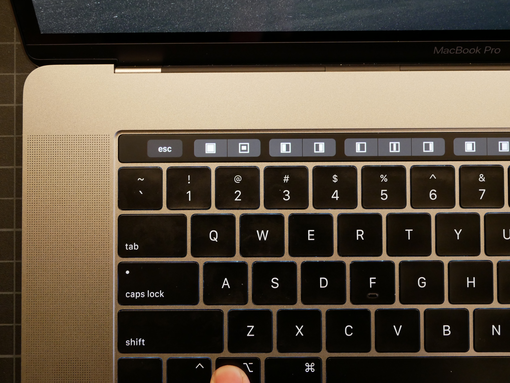

## TLDR
Install BetterTouchTool and install a configuration that you like from their community forum, then customize it.

## The Problem with the Touch Bar

When looking into the new MacBook Pro with the Touch Bar, you might find mixed reviews about how useful it actually is. Actually most reviews tend to say that it isn’t really helpful at all (except for scrolling through emojis). I found that the Touch Bar was pretty much useless as I started to experiment with it. I thought it had potential, so I looked into solving that issue.

First of all, while a lot of [applications have added support](https://9to5mac.com/2016/11/14/the-best-apps-for-macbook-pro-touch-bar-touch-id/ "Best Apps for Macbook Pro Touch Bar") for the Touch Bar, I found a lot of them lacking. I was really looking forward to whatever functionality VS Code enabled through the Touch Bar, but found that the functions they added were not useful for me. I downloaded an extension called [Nasc VSCode Touchbar](https://marketplace.visualstudio.com/items?itemName=felipe.nasc-touchbar) which enabled all of these functions:

> Go to definition, Add cursor above, Add cursor below, Run command, Toggle side bar, Toggle Panel/terminal, Rename/replace all, Duplicate lines, Toggle white space characters, Peek definition, Show references, Settings, Indent, Outdent, Jump to matching bracket, Block comment, Comment line, Select next, Go to next

It was really helpful!

But I still found that I wasn’t really using the Touch Bar outside of VS Code. So I kept looking for other solutions and found an application called BetterTouchTool. 

## BetterTouchTool

With this program, you can create icons on the Touch Bar to perform any action you like. You can open programs, resize windows, perform any shortcut, etc for each and every program on your MacBook. There was a lot of customization that I could do, but luckily I stumbled upon the community forum where members have shared their setups. I choose to start with a preset called Minimalist V2. It comes with an app switcher (similar to CMD+Tab), clock, weather, and a bunch of other features. 

### Default

I then added custom folder shortcuts for the things I access the most - including my school work directory. On the left you can see the app switcher, on the right you can see my folders, and on the far right is the clock. I can press and hold on the clock to open my calendar as well.

That’s only the beginning. You can also add modifiers for the command, option, and control keys. 

### Command Key

When I press and hold the command key, it shows a list of custom shortcuts for common applications that I use such as gmail, calendar, news, and timers. It also shows a button to lock the computer, which I use a lot.

 When I l click on timers, it actually opens another group that looks like this and is great for staying focused:

### Option Key

When you press and hold the option key, it brings up options for window management. Even though I use an application where I can drag the window to the edge to resize, I use the options to resize to thirds a lot for coding or when I’m using an external monitor.

### Control Key

When I press and hold the control key it brings up the options of Force Quitting and AirDrop. I’m still looking for other utilities to add here.

## Other Benefits

As I am writing this post, I found a post that someone set up the touch pad so that when you rotate your fingers like a small knob, it changes the volume. It’s kinda cool. I also set it so that you can change the screen and keyboard brightness with the fn key and the option key. I am still changing and adding new things, but I think the Touch Bar has become a lot more useful!
