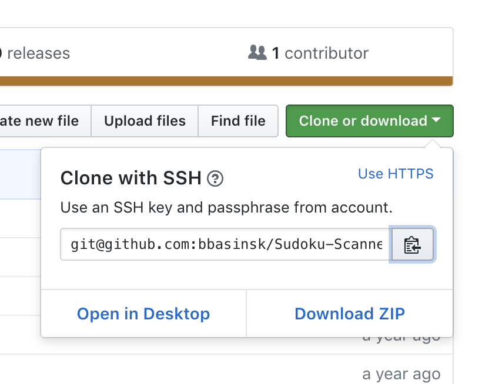
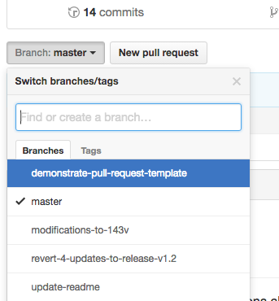

If you use code at all, I think you should learn to become comfortable with git. For those of you that aren’t familiar with git, a quick Google search will show you that it is a version-control system. That means it helps track changes on the code that you write. Every feature (or change that can stand by itself) that you add should be added and committed as a change. Git does a great job at modeling branches and changes that you make. It also allows you to make experimental changes while giving you the ability to easily go back to an older version. You can even go back to any commit that you ever made in the past, work off of that, then pick and chose which changes to ‘merge’ into your actual project.

The act of committing code means that you are putting a label on it. This means that when you go back and look through the history of your or someone else’s project, you can pick a line of code and look at when it was first created as well as when each of the modifications were made. 

## Downloading

### Clone

If you want to download a project to your own computer, you likely want to download it from Github. To do so, click on the `Clone or download` button and copy the url given.



Next, use `cd` in your terminal (Mac) or git bash (Windows) to navigate to the folder you want to ‘clone’ the project into. For example, if you are in your user folder, `cd desktop` will move you into your desktop folder. `cd ..` will bring you up a directory. If you want to list the contents of the folder you are inside, use `ls`.

When you are ready to clone, use

```bash
git clone [url]
```

For example, `git clone git@github.com:bbasinsk/HDS-Cloud-Model.git`.  After cloning, you should see a new folder created with the same name as the project cloned.

## Making Changes

As you make changes, git will automatically track those changes. After some work, you may want to save your changes as a commit. This basically means that you are creating a checkpoint for you or your teammates to go back to if need be. It also means that you can browse changes that were made at each commit, which makes it easier to see when pieces of code were changed.

The basic flow is:

```bash
git add -A
git commit -m "my message"
```

For each of these examples, use `git status` to see the status of your changes.

### Staging

Before you commit, you bring files to a staging area by using `git add`. Only files in the staging area are committed. This makes it much easier to only commit certain files without throwing away your work in other files.

### Committing All Changes

So you made a change that you want to commit. First, `git add -A`will take all of the changes in your repo and add them to the staging area. You can then use `git commit -m "My commit message"` to commit the changes. Use `git log` to show that the last commit was indeed made. Press `q` to get out of that screen.

### Committing Some Changes

Let’s say you edited two files: `file1.md` and `file2.html`, and you only want to commit `file1.md`. To stage only `file1.md`, just use `git add file.md`. You can then check that that file was added to staging by using `git status`. You should see `file1.md` in your ‘Changes to be committed:’. Then use `git commit -m "My message"`.

## Uploading

Great, so you made some changes and now you want to save them by uploading them to GitHub. First, if you’d like, make sure that the changes you want to push have been committed by using `git log`. 

If you have access to the repository, you can use `git push` to push the current branch changes up to GitHub. (More on branches in the next section)

## Working With Others

If you are working with others, the first thing you want to learn is how branches work. Usually, each feature that each person is working on should have its own branch.  

Let’s say that we have a website that I was invited to work on with some friends and they want me to make a page for a contact form. The first thing I’d do is clone the repository. Then you’d want to make a new branch:

```bash
git checkout -b branch-name
```

For our case, we would chose a branch named “contact-form”. That will automatically bring us into working in our new branch. We can then make changes as normal, stage those changes (`git add -A`), and commit those changes (`git commit -m "made contact form"`). 

Next, you’ll want to push your changes up GitHub so that your friends can review the changes you made. Using`git push`will actually prompt you to use `git push -u origin branch-name` because the branch doesn’t exist on GitHub yet. I’d just use `git push` and copy/paste the command.



If you head up to GitHub, you should see the new branch and be able to submit a PR (pull request). When the PR is approved and merged, the changes from your “contact-form” branch will be merged into the master branch.
