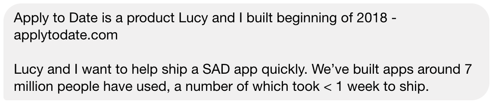
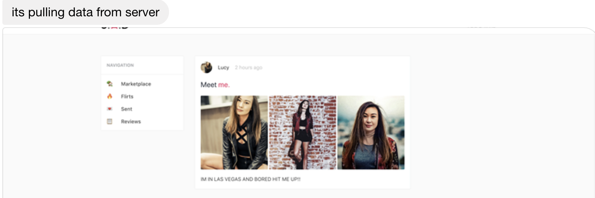
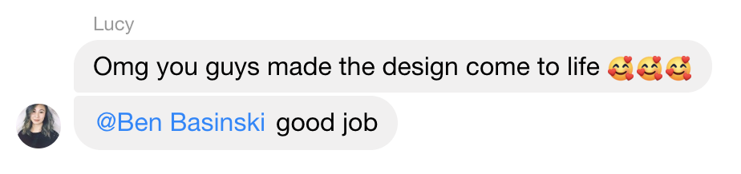
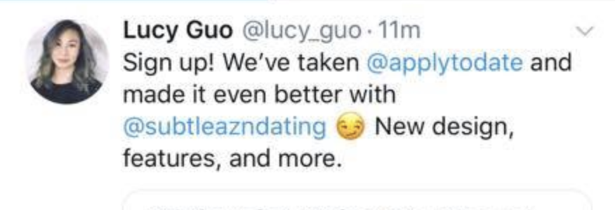
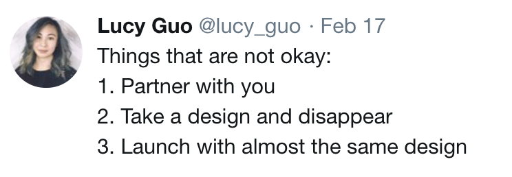
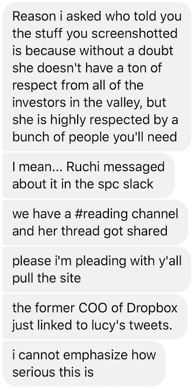

## The story

We launched a dating site. It only lasted for 6 hours. The site got 1000 users and 100 matches in 6 hours. It came crashing down, but not for the any of the reasons you would think.

Let's rewind to **January 1st**. As we were beginning work, a designer, Lucy, reached out to us and suggested that she might be able to help. She was a Thiel Fellow, started her own company - Scale, was a Forbes 30 under 30, has worked at Quora and Snapchat, and has 13k followers on Twitter. We were obviously stoked to work with her. Lucy, along with an engineer from Stripe had built a dating site called “Apply To Date” in early 2018. It was featured on ProductHunt, but never gained a user base. During the first video chat with them, they emphasized the value of being able to work off of their existing site. It was a win win scenario because they had talent and existing infrastructure while we already had a user base, a Facebook group with 350k members. The Facebook group has very unique *auction style* posts, and we wanted to make sure that new site would facilitate those posts. We made it clear that this was core to the user's experience.

We were excited to get started. Fast forward one day of discussion and Lucy already had design. By **January 3rd**, Jarred had a small part of the UI pulling data from a server. Things were going great and we were all excited to contribute in whatever way we could. But progress quickly slowed. By January 6th, Lucy started pushing for us to rebrand her Apply To Date site rather than helping us design around the existing Facebook group experience. Around this time, Lucy's engineer friend started becoming unresponsive, and the progress and communications stalled.

We continued iterating for **another month** until we decided to launch the weekend after Valentine's Day. We announced on the Facebook page that an app would be coming out soon and had users sign up for a waitlist. We were extremely excited. Shortly after the announcement, Lucy reached out to us congratulating us on the progress. After seeing the progress made on the site, she also offered to help us with the final steps leading up to our launch. **Let me re-iterate that she saw our un-released site.**

Soon after communication with Lucy, she tweeted that our product was a iteration of Apply To Date. I think that this was the first red flag. **In no way was it an iteration.** It was a completely different design, code base, and had completely different functionality. Like I mentioned earlier, it is core that our product was specially built for our user base. We wanted to make sure that it was not miscommunicated that our product was just an iteration of an existing product. And we asked Lucy to take down the tweet. She did, and we continued preparing for our launch.

Fast forward to **February 17th**, and we were ready for launch. Around 5pm, we started emailing users on our waitlist, and people started coming. More than 1000 users signed up and 100 people matched. There were a couple small issues that became apparent - the biggest one of them being that image hosting costs were higher than expected. But technical issues are easily fixable. People issues are a bit more difficult.

At 11pm, Lucy tweeted that we stole her designs. Now, I get that it is important to respect intellectual property, but if she wanted us to not use her designs or if she wanted us formally give her credit, or if she wanted us to pay her, she could have mentioned it at any point prior to launching. There was a great opportunity for her to show her concerns when we showed her our demo.

By midnight, friends of our team in start-ups and investments started reaching out. They begged us to take down the site to save our reputation. After discussion, we took down the site around 1am.

## What I learned from this experience

1. Experience doesn't mean professionality
2. Give credit, even when not asked for
3. Be selective with who you work with

Given Lucy's background, it surprised me that she acted the way that she did. She tweeted about our product without asking for input. She obviously wanted credit and to be a part of the team, but she didn't communicate that with us.

On our side, we could've done a better job at giving anyone who has worked with us the credit they deserve. Lucy may have only spent one day on the designs, but they were obviously good enough for us to use them for our launch, and we should've figured out a way to **express how much of a help she was.**

Lucy helped with designs, but now we have to redesign anyways. Long term, working with **Lucy actually caused us to do more work than if we said "no"** to working with her. You always hear that being selective with who you work with is very important, but I learned this the difficult way.

**I would love to hear your thoughts! (There's a contact form on this site)**
What could I have done differently? How do you think we should move forward?